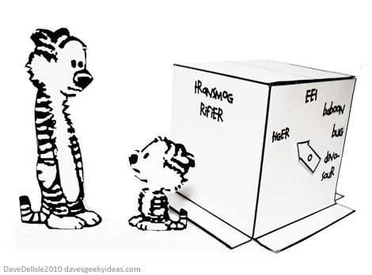

# File One

## TRANSMOGRIFY


This is a line with an image in it 

this is a line with two images in it  and 


## Sub dir test

This is a line with an image in it 


## CODE BLOCKS

```python
def hello_world():
    print("Hello, World!")
```

```yaml
name: John Doe
age: 30
```

```json
{
    "name": "John Doe",
    "age": 30
}
```

```
empty code block
```
